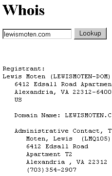



## ASP Whois Component with sample code

### Description

I was searching on the 'net for a whois COM object and everyone is charging $20 - $250 for a very simple object. I was a little low on cash and had the day off. This COM object includes ASP code and a list of over 250 whois databases on the net.
 
### More Info
 
Domain Name

Your common whois lookup text.

Havn't tested on other platforms. please notify me of any problems.

             |
---                |---
**Submitted On**   |2001-02-18 19:33:18
**By**             |[Lewis E\. Moten III](https://github.com/Planet-Source-Code/PSCIndex/blob/master/ByAuthor/lewis-e-moten-iii.md)
**Level**          |Intermediate
**User Rating**    |5.0 (10 globes from 2 users)
**Compatibility**  |VB 6\.0, ASP \(Active Server Pages\) 
**Category**       |[Internet/ HTML](https://github.com/Planet-Source-Code/PSCIndex/blob/master/ByCategory/internet-html__1-34.md)
**World**          |[Visual Basic](https://github.com/Planet-Source-Code/PSCIndex/blob/master/ByWorld/visual-basic.md)
**Archive File**   |[CODE\_UPLOAD151662182001\.zip](https://github.com/Planet-Source-Code/lewis-e-moten-iii-asp-whois-component-with-sample-code__1-21133/archive/master.zip)

